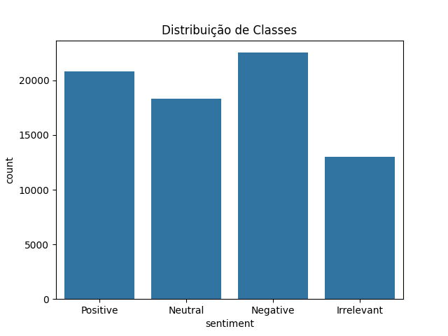
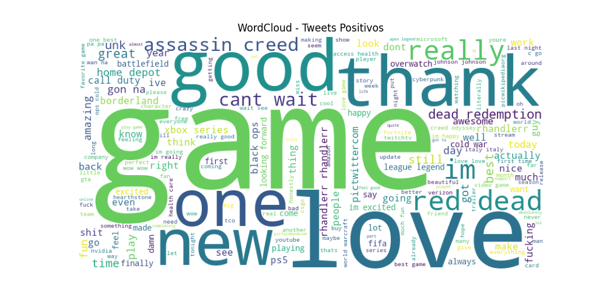
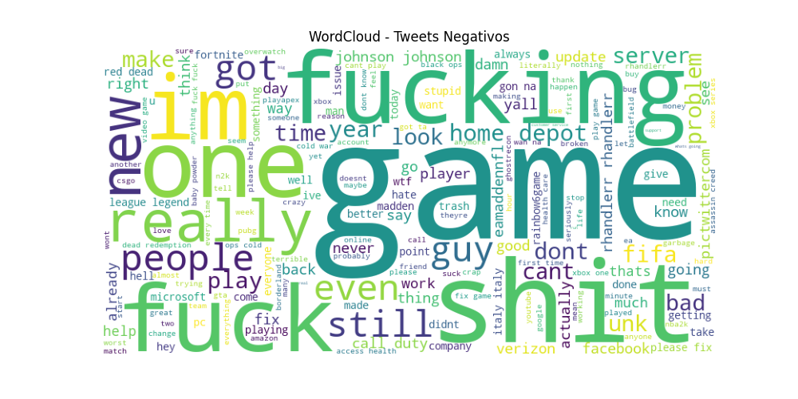
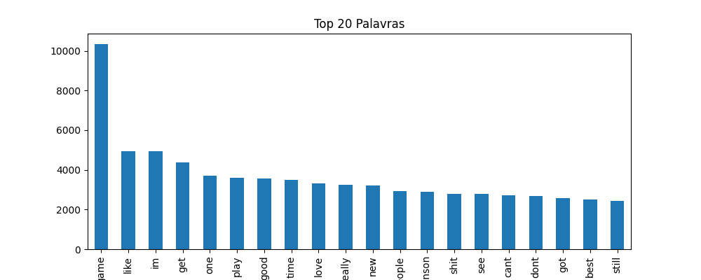
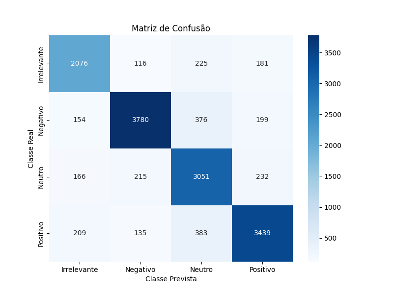
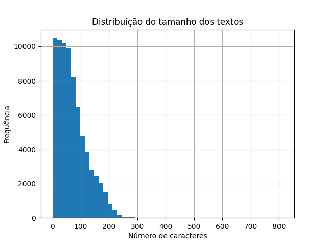
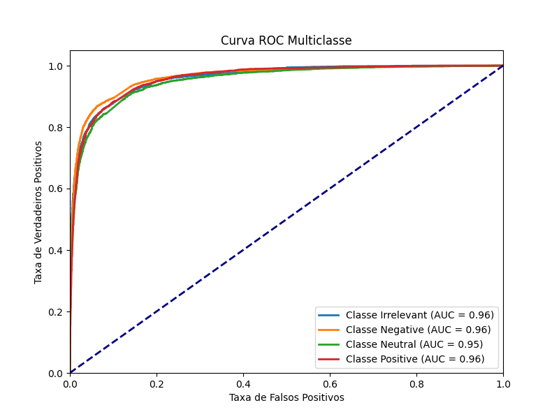

# 📊 Análise de Sentimento (NLP) sobre Tweets

## 📌 Descrição
Projeto de **classificação de sentimento** aplicado a tweets. O objetivo é identificar **sentimentos** (positivo / neutro / negativo) em textos curtos, gerar **visualizações** (wordclouds) e disponibilizar um **pipeline** reprodutível para inferência em produção.


## 🎯 Objetivos da Análise
- **Construir um modelo de classificação** de sentimento com boa performance.
- **Gerar insights** sobre palavras mais frequentes por classe.
- **Disponibilizar um endpoint** simples para inferência.
- **Documentar o processo** para reprodutibilidade.

## ❓ Perguntas de Negócio
- Qual a distribuição de sentimento (positivo / neutro / negativo) na base?
- Quais palavras/termos aparecem mais em tweets positivos vs. negativos? (wordclouds)
- Qual a acurácia prática do modelo em identificar sentimento (Precision, Recall, F1 por classe)?
- O modelo é robusto a ruído: URLs, menções, emojis?
- Como a análise pode suportar ações (monitoramento de marca, detecção de crises, automação de respostas)?


## 🗂️ Estrutura do Projeto

```
projeto-nlp-sentimento/
├── data/
│   ├── raw/twitter_training.csv        # Arquivo CSV utilizado
│   ├── raw/twitter_validation.csv      # Arquivo CSV para validação
│   └── generate/predictions.csv        # Arquivo CSV com predições
├── notebooks/
│   ├── eda_nlp.ipynb                   # Notebook com análise exploratória
│   └── modelagem_nlp.ipynb             # Notebook com modelagem
├── src/
│   ├── pre-processamento.py            # Funções de pré-processamento
│   ├── predicao.py                     # Script para gerar predições
│   └── api.py                          # API para inferência            
├── models/
│   └── modelo_sentimento.pkl           # Modelo treinado salvo
├── assets/
│   ├── curva_ROC.png                           # Curva ROC do modelo
│   ├── distribuicao_classes_sentimentos.png    # Distribuição das classes
│   ├── distribuicao_tamanho_tweet.png          # Distribuição do tamanho dos tweets
│   ├── matriz_confusao.png                     # Matriz de confusão do modelo
│   ├── nuvem_palavras_negativas.png            # Nuvem de palavras negativas
│   ├── nuvem_palavras_positivas.png            # Nuvem de palavras positivas
│   └── palavras_frequentes.png                 # Palavras mais frequentes
├── requirements.txt                    # Dependências do projeto 
└── README.md                           # Documentação do projeto
```

## 🔧 Ferramentas Utilizadas
- **Python 3.14+**
- **Pandas / Numpy / Unidecode** – Manipulação de dados
- **Scikit-learn** – Modelagem preditiva
- **Joblib** – Salvamento do modelo
- **FastAPI / Unicorn** – Criação de API para inferência
- **WordCloud / NLTK** – Processamento de linguagem natural
- **Matplotlib / Seaborn / WordCloud** – Visualização de dados
- **Jupyter Notebook** – Documentação da análise

---

## 📊 Principais Insights

### Distribuição das Classes de Sentimento
- A base de dados apresenta uma distribuição relativamente equilibrada entre as classes de sentimento com exceção da classe **Irrelevante** que é a menos representada.:
  - **Positivo**: 27.8%
  - **Neutro**: 24.5%
  - **Negativo**: 30.1%
  - **Irrelevante**: 17.3%

- A classe **Negativo** é a mais frequente, seguida por **Positivo** e **Neutro**. A classe **Irrelevante** é a menos representada.




---

### Palavras Mais Frequentes em Sentimentos Positivos e Negativos
- **Positivo**: As palavras mais frequentes incluem "love", "great", "happy", "good", "amazing", "best", "fun", "awesome", "like", "thank".
- **Negativo**: As palavras mais frequentes incluem "hate", "bad", "sad", "angry", "terrible", "worst", "awful", "disappointed", "sucks", "annoyed".

 


---

### Palavras Mais Frequentes no Dataset
- As palavras mais frequentes no dataset geral incluem "game", "like", "im", "get", "one", "play", "good", "time", "love", "really", "new".


### Precisão do Modelo

#### **Acurácia**: 83%
#### **Recall**: 82%
#### **F1-score**: 82%

- O modelo apresenta uma **acurácia geral de 83%**, com bom equilíbrio entre precisão e recall para todas as classes.
- A classe **Negativo** tem a maior precisão (89%) e recall (84%), indicando que o modelo é eficaz em identificar tweets negativos.
- A classe **Irrelevante** tem a menor precisão (80%) e recall (80%), sugerindo que o modelo tem mais dificuldade em classificar corretamente tweets irrelevantes.



---

### Modelo Robusto a Ruído
- O modelo mostrou-se robusto a ruídos comuns em tweets, como URLs, menções e emojis, graças ao pré-processamento eficaz.
- A remoção de URLs e menções, bem como a normalização de texto, ajudaram a melhorar a qualidade dos dados de entrada.
- Emojis foram convertidos em texto descritivo, permitindo que o modelo capturasse o sentimento associado a eles.
- A análise de erros indicou que a maioria dos erros de classificação ocorreu em tweets curtos ou ambíguos, onde o contexto é limitado.




---

### Suporte a Ações
- A análise de sentimento pode ser utilizada para **monitoramento de marca**, identificando rapidamente tweets negativos que possam indicar crises.
- Pode também ser usada para **automação de respostas**, direcionando tweets positivos para campanhas de engajamento e tweets negativos para atendimento ao cliente.
- A criação de dashboards interativos pode facilitar o acompanhamento em tempo real do sentimento dos tweets relacionados à marca ou produto.




---

## Próximos Passos
- **Avaliar modelos** baseados em transformers (BERT) para comparar performance.
- **Adicionar validação** temporal (se aplicável) e engenharia de features (emoji features, emoticons, presença de link).
- **Construir dashboard** em Streamlit que mostre volume de sentimento ao longo do tempo.
- **Implementar monitoramento** de modelo (drift) em produção.

## 📌 Como Reproduzir
```bash
git clone https://github.com/GabrielButti/Projeto-NLP-Analise-Sentimento-Twittes.git
cd Projeto-NLP-Analise-Sentimento-Twittes
pip install -r requirements.txt
python src/pre_processamento.py
jupyter notebook notebooks/modelagem_nlp.ipynb
python src/predicao.py
python src/api.py
uvicorn src.api:app --reload --port 8000
```

